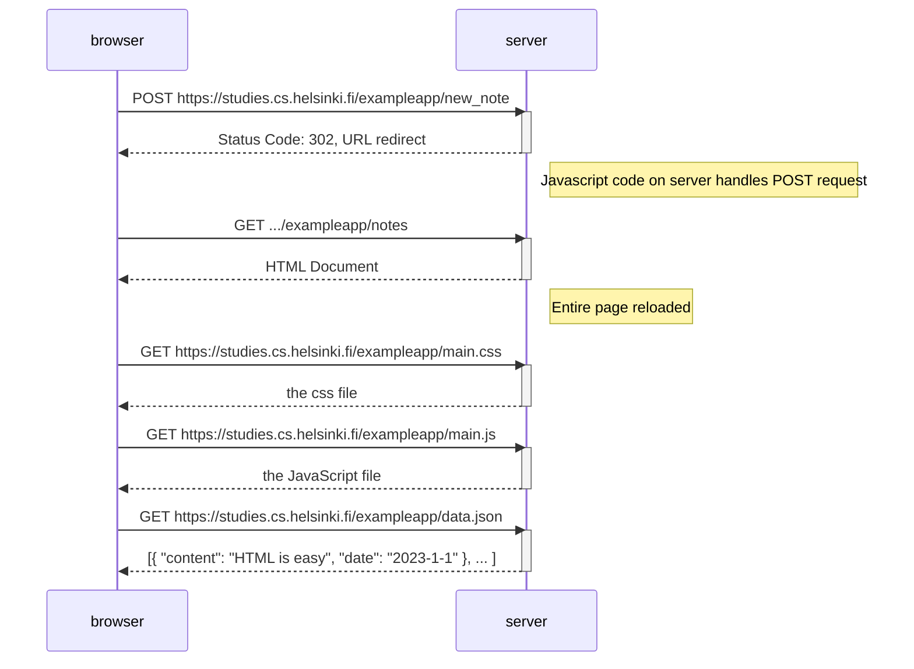
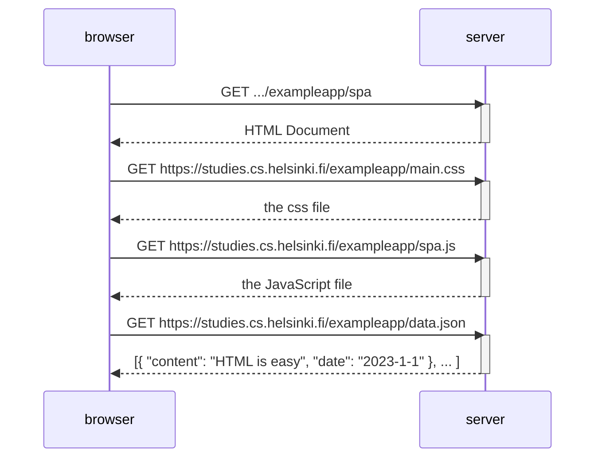
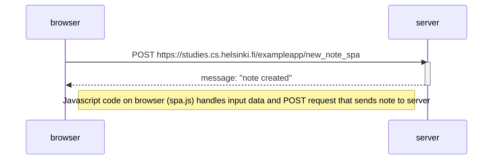

# Part 0 Exercises

## 0.4 New Note Diagram

```mermaid
sequenceDiagram
    participant browser
    participant server
    
    browser->>server: POST https://studies.cs.helsinki.fi/exampleapp/new_note
    activate server
    server-->>browser: Status Code: 302, URL redirect
    deactivate server
    
    Note right of server: Javascript code on server handles POST request
    
    browser->>server: GET .../exampleapp/notes
    activate server
    server-->>browser: HTML Document
    deactivate server 

    Note right of server: Entire page reloaded
     
    browser->>server: GET https://studies.cs.helsinki.fi/exampleapp/main.css
    activate server
    server-->>browser: the css file
    deactivate server

    browser->>server: GET https://studies.cs.helsinki.fi/exampleapp/main.js
    activate server
    server-->>browser: the JavaScript file
    deactivate server

    browser->>server: GET https://studies.cs.helsinki.fi/exampleapp/data.json
    activate server
    server-->>browser: [{ "content": "HTML is easy", "date": "2023-1-1" }, ... ]
    deactivate server 
```
## 0.5 Single page app diagram

```mermaid
sequenceDiagram
    participant browser
    participant server
    
    browser->>server: GET .../exampleapp/spa
    activate server
    server-->>browser: HTML Document
    deactivate server 
     
    browser->>server: GET https://studies.cs.helsinki.fi/exampleapp/main.css
    activate server
    server-->>browser: the css file
    deactivate server

    browser->>server: GET https://studies.cs.helsinki.fi/exampleapp/spa.js
    activate server
    server-->>browser: the JavaScript file
    deactivate server

    browser->>server: GET https://studies.cs.helsinki.fi/exampleapp/data.json
    activate server
    server-->>browser: [{ "content": "HTML is easy", "date": "2023-1-1" }, ... ]
    deactivate server 
```

## 0.6 New note in Single page app diagram

```mermaid
sequenceDiagram
    participant browser
    participant server
    
    browser->>server: POST https://studies.cs.helsinki.fi/exampleapp/new_note_spa
    activate server
    server-->>browser: message: "note created"
    deactivate server
    
    Note right of browser: Javascript code on browser (spa.js) handles input data and POST request that sends note to server
```
